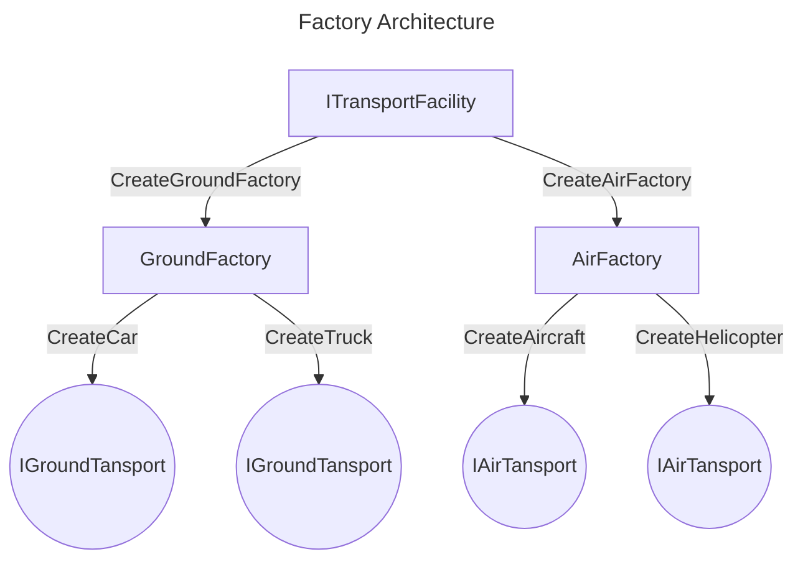

# AbstractFactory-Example

This project is an example of the application of the "Abstract Factory" pattern. Using the example of a transport manufacturing factory, the architecture and applicability of this pattern are shown.

After choosing the type of production (ground / air), we create the transport we need and work with it.